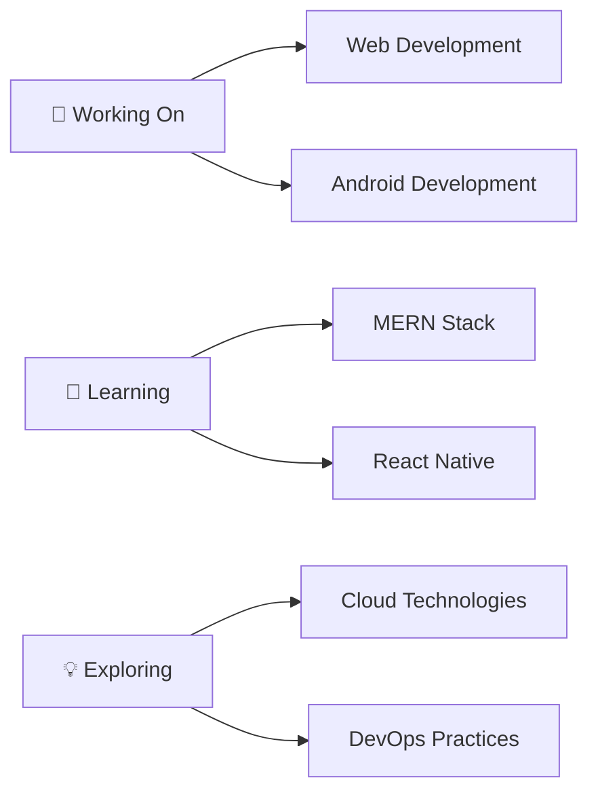

# 👋 Hey there! I'm Aditya Shah

<div align="center">
  
  

  [](https://adityanshah.netlify.app/)
  [](https://linkedin.com/in/aditya-shah-a10494263)
  [](mailto:192105adityashah@gmail.com)

</div>

## 🚀 About Me

```javascript
const aditya = {
    pronouns: "He/Him",
    location: "India 🇮🇳",
    currentFocus: ["Web Development", "Android Development"],
    learning: ["MERN Stack", "React Native"],
    askMeAbout: ["Web Development", "Frontend", "React", "JavaScript"],
    funFact: "I turn coffee into code ☕→💻"
};
```

## 🛠️ Tech Arsenal

<div align="center">

### Frontend


### Backend & Database


### Mobile & Other Technologies


### Tools & Platforms


</div>

## 📊 GitHub Analytics

<div align="center">
  
  
</div>

<div align="center">
  
</div>

## 🎯 Current Focus



## 🏆 GitHub Trophies

<div align="center">
  
</div>

## 📈 Activity Graph

<div align="center">
  
</div>

## 💭 Random Dev Quote

<div align="center">
  
</div>

## 🎨 Featured Projects

<div align="center">


*Explore more projects on my [Portfolio Website](https://theadityashah.in/) 🚀*

</div>

## 🤝 Let's Connect!

<div align="center">

**Open to collaborating on exciting projects!**

Whether it's a web application, mobile app, or an innovative idea you want to bring to life, I'm always excited to work with fellow developers and creators.

📧 **Reach out:** [192105adityashah@gmail.com](mailto:192105adityashah@gmail.com)

</div>

---

<div align="center">
  
  
  **Thanks for visiting! ⭐ Star some repos if you find them interesting!**
</div>
